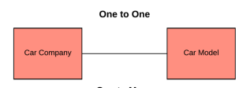

#  One to One Relationship #

Maksud dari one to one relationship adalah, satu baris data di tabel utama terhubung dengan
satu baris data di tabel kedua. Dan begitu juga sebaliknya, satu baris data di tabel kedua,
terhubung dengan satu baris data di tabel utama.
Contoh dari konsep ini seperti satu mahasiswa yang memiliki satu nilai ipk, atau satu
perusahaan memiliki satu nomor telepon.
Sebenarnya, relationship one to one tidak terlalu sering di pakai, karena pada dasarnya jika
satu baris data hanya berhubungan dengan satu data lain (dan begitu juga sebaliknya), maka
kedua tabel bisa digabung menjadi satu tabel panjang.
Alasan utama pembuatan relationship one to one lebih ke performa, karena bisa jadi hanya
beberapa kolom saja yang sering di akses, sedangkan kolom lain lebih ke data tambahan. Data
tambahan inilah yang bisa dipecah menjadi tabel kedua. 

Dalam diagram ERD (Entity Relationship Diagram), relationship one to one digambarkan
dengan satu garis yang tidak bercabang

